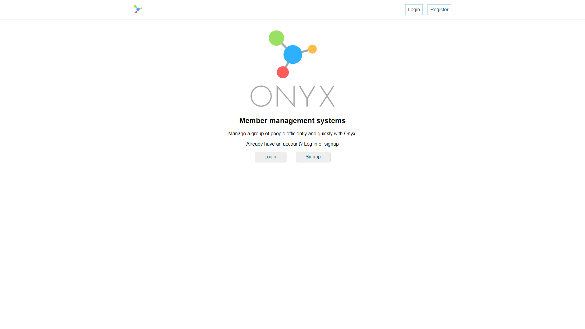
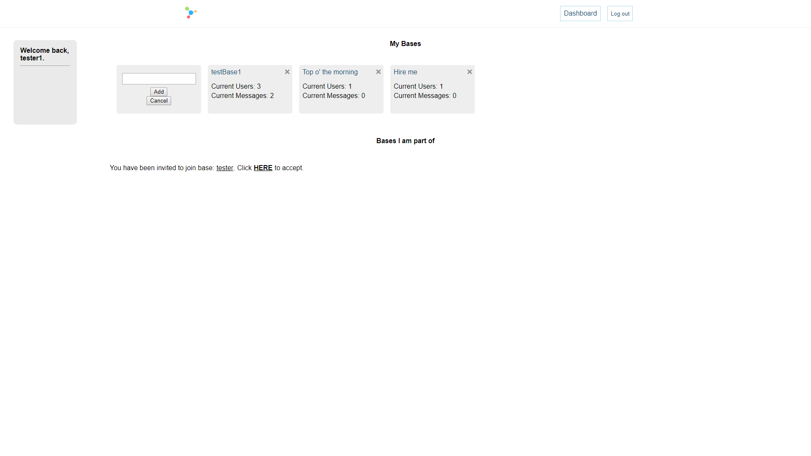

# Onyx

A member management system. Onyx lets you create a base for any topic, add users, and send messages.

## Live Demo

[View Demo here](https://boiling-dawn-20827.herokuapp.com/dashboard)

## Summary

Users are able to register accounts. Once logged in, users can create and delete bases, and perform CRUD operations by adding users or messages to each list.

Each user who has been added to someone else's base will be notified on their home panel, and first has to accept the invitation before having access to the base.

## Screenshots
Landing page:

Login page:

Dashboard page:

Base page:

## Built with:
### Front-End
* HTML 5
* CSS
* Javascript
* React

### Back-End
* Node.js
* Express

### Database
* Mongo
* Mongoose

### Testing
* Enzyme
* Jest

### Other
* Redux
* Passport.js
* Thunk